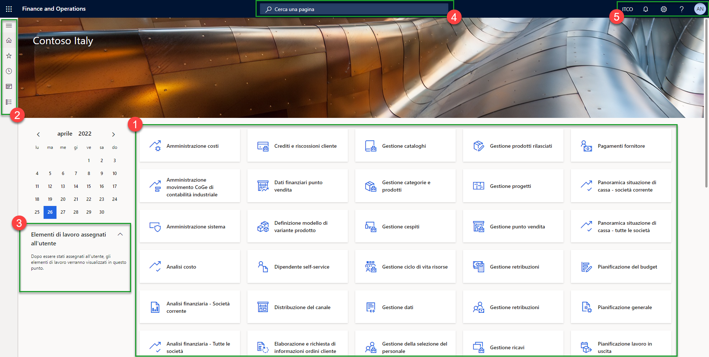

Interfaccia Utente
==================

La schermata iniziale può essere personalizzata a livello aziendale o a livello di utente. In questo esempio partiremo da uno screen standard per affrontare il discorso personalizzazioni più avanti nel manuale.
Una visualizzazione, tra cui quella iniziale, è conosciuta anche con il nome di Dashboard.

Notiamo subito le differenti parti che compongono il nostro dashboard.

.. Hint:: Benchè Dynamics 365 Finance and Operation funzioni sui principali browser, raccomando l'utilizzo di Microsoft Edge

