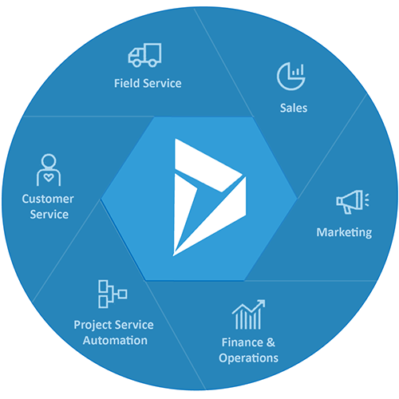

Introduzione
================

Il termine ERP, acronimo di Enterprise Resource Planning, si riferisce a un tipo di software che le organizzazioni utilizzano per gestire le attività quotidiane di business. I sistemi ERP mettono in relazione tra loro un insieme di processi di business e ne consentono lo scambio di dati. Grazie alla raccolta di dati transazionali condivisi provenienti da diverse fonti dell'organizzazione, i sistemi ERP eliminano la duplicazione dei dati e ne garantiscono l'integrità tramite un'unica fonte di informazioni.

**Microsoft Dynamics 365 Finance & Operations** è l'ERP di Microsoft per le medie e grandi anziende. La soluzione, parte della gamma Dynamics 365, collega e integra i dati di contabilità, finanza, vendite, magazzino, clienti, ecc..

   L'ecosistema Dynamics 365

Questa documentazione online vuole semplificare l'impatto con il sistema, fornendo un set di istruzioni operative organizzate per aree tematiche e facilmente accessibili dagli utenti.

.. Caution:: La presente guida d'uso e tutti gli screenshot allegati si riferiscono ad un'installazione standard Microsoft che può differire, anche profondamente, da quanto implementato nella propria organizzazione. Tutte le informazioni qui contentute hanno il solo scopo informativo e in nessun caso saremo responsabili per qualsiasi perdita o danno inclusi, senza limitazioni, perdite o danni indiretti o consequenziali, o qualsiasi perdita o danno derivante dalla perdita di dati o profitti derivanti da, o in connessione con, l'uso di questo sito.

